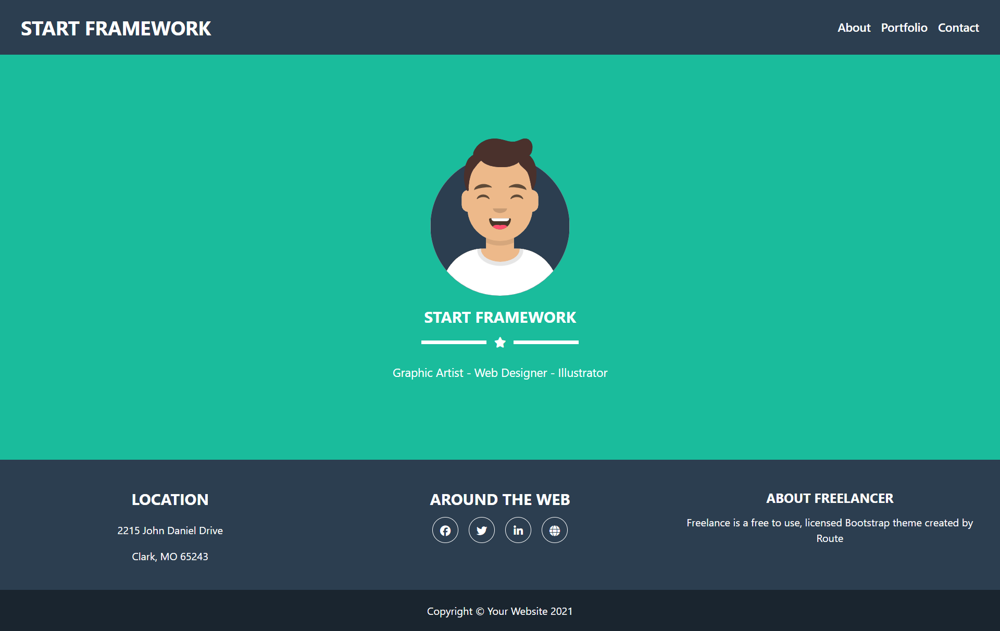

# ⚛️ React Projects Collection

A collection of **React.js applications** built to practice component-based architecture, routing, props, hooks, and modern front-end patterns.  
Each project focuses on improving interactivity, clean structure, and reusable UI components.

---

## 📚 Projects Included

| Project | Preview | Description |
|----------|----------|--------------|
| **🌸 Start Framework** |  | A clean, minimal personal portfolio website built using React Router, reusable components, and modern UI styling. |
| **🛒 E-commerce FreshCart** |  | A dynamic e-commerce web app featuring product listing, cart management, and responsive design using React hooks and routing. |

---

## 🚀 How to Run Locally

To run any project locally, follow these steps:

1. **Open the folder** of the project you want (for example: `E-commerce-FreshCart`)
2. Open the terminal inside that folder.
3. Run the following commands:

   ```bash
   npm install
   npm start
**4.** The project will open automatically at http://localhost:3000
--- 

## 🧩 Technologies Used
React.js

React Router DOM

JSX & Components

CSS3 / SCSS

JavaScript (ES6+)

## 🎯 Purpose
Practice React fundamentals and routing.

Build responsive and reusable UI components.

Improve state management and app structure.

## 👩‍💻 Author
**Reem Haitham**
Front-End Developer | Passionate about building beautiful and interactive React apps ⚡